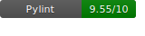
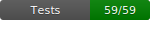

# Liverpool Natural History Museum: Plant Health Monitoring System
  


<!-- TABLE OF CONTENTS -->
<details>
  <summary>Table of Contents 📝</summary>
  <ol>
    <li>
      <a href="#about-the-project">About The Project</a>
      <ul>
        <li><a href="#Diagrams">Diagrams</a></li>
      </ul>
      <ul>
        <li><a href="#built-with">Built With</a></li>
      </ul>
    </li>
    <li>
      <a href="#getting-started">Getting Started</a>
      <ul>
        <li><a href="#prerequisites">Prerequisites</a></li>
        <li><a href="#installation">Installation</a></li>
      </ul>
    <li>
    <a href="#Requirements">Requirements</a>
    </li>
    <li>
    <a href="#folders-explained">Files Explained</a>
    </li>
    <li>
    <a href="#files-explained">Folders Explained</a>
    </li>
    <li>
    <a href="#developers">Developers</a>
    </li>
  </ol>
</details>

## About the Project 🌱
Liverpool Natural History Museum (LNMH) employs an array of Raspberry Pi sensors to monitor critical plant health metrics such as soil moisture and temperature across their conservatory. However, the museum is seeking to enhance its monitoring system by tracking the health of plants over time and providing real-time alerts for gardeners when there is a problem. This project delivers a fully-functioning cloud-based Extract Transform Load (ETL) pipeline incorporating short- and long-term data storage solutions. In addition, the project includes a dynamic dashboard which allows staff constant access to a source of continually updating information. 


### Diagrams 📊

#### Architecture Diagram


#### ERD Diagram


#### Dashboard Wireframe


### Built With
 [![Python][Python.com]][Python-url]


## 🛠️ Getting Started
Prerequisites:
- Python 3.10 must be installed with pip3 for dependency installation.  


## Installation ⚙️
These instructions are for **macOS only**.

1. **Clone the repository to your local machine using the following command**:
    ```sh
    git clone https://github.com/SurinaCS/Coursework-Data-Engineering-Week-5.git
    ```
2. **Navigate into the cloned repository**.
3. **Install `freedtds` and `sqlcmd`**:
    ```sh
    brew install freetds
    ```
    ```zsh
    brew install sqlcmd
    ```
4. **Setup venv environment**:
    ```zsh
    python3.10 -m venv .venv
    source .venv/bin/activate
    ```
5. **Install all required dependencies**:
    ```sh
    pip3 install -r requirements.txt
    ```
6. **Configure AWS CLI**:
    - Install AWS CLI if you don't have it already:
        ```sh
        brew install awscli
        ```
    - Configure your AWS credentials by running:
        ```sh
        aws configure
        ```
      You will be prompted to enter your AWS Access Key ID, Secret Access Key, region, and output format. Make sure to provide your AWS credentials when prompted.

7. **Login to AWS**:
    - Once configured, you can log in to AWS from your terminal using:
        ```sh
        aws sts get-caller-identity
        ```
      This will confirm that you are authenticated and have access to your AWS resources.

## Requirements 📋
You must have a `.env` file containing:   
| Variable         | Description                                      |
|------------------|--------------------------------------------------|
| DB_HOST          | The hostname or IP address of the database.      |
| DB_PORT          | The port number for the database connection.     |
| DB_PASSWORD      | The password for the database user.              |
| DB_USER          | The username for the database.                   |
| DB_NAME          | The name of the database.                        |
| SCHEMA_NAME      | The name of the database schema.                 |

   
## Folders Explained 📁
These folders are found this repository:     
- **[archive](https://github.com/SurinaCS/lmnh-plant-sensors/tree/main/archive)**     
   This folder contains the necessary files to move the data extracted from the previous 24hrs to the S3 bucket where 'archived' data is stored.
- **[dashboard](https://github.com/SurinaCS/lmnh-plant-sensors/tree/main/dashboard)**
  This folder contains the scripts needed to create the dashboard, showing dynamic visualisations on plant health for the staff to access.

- **[pipeline](https://github.com/SurinaCS/lmnh-plant-sensors/tree/main/pipeline)**
  This folder contains the ETL pipeline scripts including:
    - _Extract_: Fetching the data from the API endpoint (https://data-eng-plants-api.herokuapp.com/plants/49) every minute for all plants.
    - _Load_: Cleans data to ensure reliability (mitigate impact of faulty sensors).
    - _Transform_: Loads the clean data into a Microsoft SQL Server Database (RDS).

- **[terraform](https://github.com/SurinaCS/lmnh-plant-sensors/tree/main/terraform)**  
  This folder contains the infrastructure-as-code (IaC) setup using Terraform. It includes the configuration files to provision and manage cloud resources, required for the Plant Health Monitoring System. These resources are essential for setting up the cloud environment that supports the ETL pipeline and real-time dashboard.


## Files Explained 🗂️
These files are found in this repository:
- **README.md**  
  This is the file you are currently reading, containing information about each file.   
- **requirements.txt**  
  This project requires specific Python libraries to run correctly. These dependencies are listed in this file and are needed to ensure your environment matches the project's environment requirements.


[Python.com]: https://img.shields.io/badge/python-3670A0?style=for-the-badge&logo=python&logoColor=ffdd54
[Python-url]: https://www.python.org/


## Developers 👨🏽‍💻👩🏽‍💻
This project was developed by the following contributors:

- **[Surina Santhokhy](https://github.com/SurinaCS)** - Project Manager & Data Engineer
- **[Qasim Rafiq](https://github.com/qrafiq1)** - Architect & Data Engineer
- **[Keogh Jokhan](https://github.com/keoghrmj)** - Quality Assurance & Data Engineer
- **[Fariha Choudhury](https://github.com/farihachoudhury)** - Quality Assurance & Data Engineer